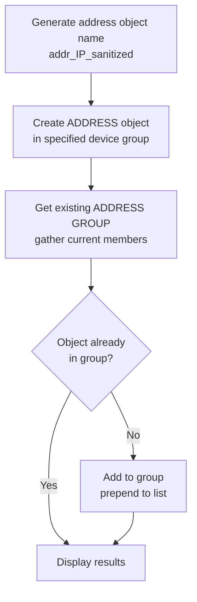

# add_address_to_preset_group.yml

**Location:** `roles/policy_creation/tasks/preset/add_address_to_preset_group.yml`

## Purpose
Creates an address object for a given IP address and adds it to an existing address group. This is used when traffic matches a preset policy that uses address groups, allowing new addresses to be added to existing policies without creating entirely new rules.

## What it does
1. **Generates object name** - Creates a standardized name for the address object
2. **Creates address object** - Creates the address object in the specified device group
3. **Retrieves existing group** - Gets the current members of the target address group
4. **Updates address group** - Adds the new address object to the group (if not already present)
5. **Displays results** - Shows the operation status

## Execution Flow



## Required Variables

| Variable | Description |
|----------|-------------|
| `_address` | The IP address or CIDR to add (passed when including this task) |
| `_address_group` | The name of the address group to update (passed when including this task) |
| `policy_creation_device_group` | The device group where objects are created |
| `provider` | PAN-OS connection details (ip_address, username, password) |

## Generated Variables

| Variable | Format | Description |
|----------|--------|-------------|
| `policy_creation_created_object_name` | `addr_<ip_sanitized>` | The name of the created address object |
| `policy_creation_address_creation` | dict | Result from address object creation |
| `policy_creation_existing_group` | dict | Gathered state of the address group |
| `policy_creation_group_addition` | dict | Result from adding object to group |

## Address Object Naming

IP addresses are sanitized for object names by:
- Replacing `.` with `_`
- Replacing `/` with `_`

Examples:
- `10.1.1.5` → `addr_10_1_1_5`
- `192.168.1.0/24` → `addr_192_168_1_0_24`

## Address Object Properties

Created objects have:
- **Type**: `ip-netmask`
- **Device Group**: From `policy_creation_device_group` variable
- **Description**: `"Auto-created address object for <ip_address>"`
- **State**: `present`

## Address Group Update Behavior

### Gathering Existing Members
The task uses `state: gathered` to retrieve the current address group configuration:
```yaml
panos_address_group:
  state: gathered
```

This returns the existing `static_value` list of member objects.

### Adding New Member
The new object is **prepended** to the existing list:
```yaml
static_value: "{{ [new_object] + existing_objects }}"
```

This places the new address object at the beginning of the group's member list.

### Conditional Update
The group is only updated when:
```yaml
when: policy_creation_created_object_name not in policy_creation_existing_group.gathered.static_value
```

This prevents duplicate additions and ensures idempotency.

## Dependencies

- Requires PAN-OS collection (`paloaltonetworks.panos`)
- Requires the following modules:
  - `panos_address_object`
  - `panos_address_group`
- Address group must already exist in the device group

## Usage Context

This file is included from `main.yml` when preset policies match:

```yaml
- name: ADDRESS GROUP PRESET - Deploy the Source IP to policy based on preset configuration
  ansible.builtin.include_tasks:
    file: preset/add_address_to_preset_group.yml
  vars:
    _address: "{{ policy_creation_source_ip }}"
    _address_group: "{{ policy_creation_source_address_group }}"
  when:
    - policy_creation_source_address_group is defined
```

And similarly for destination IPs:

```yaml
- name: ADDRESS GROUP PRESET - Deploy the Destination IP to policy based on preset configuration
  ansible.builtin.include_tasks:
    file: preset/add_address_to_preset_group.yml
  vars:
    _address: "{{ policy_creation_destination_ip }}"
    _address_group: "{{ policy_creation_destination_address_group }}"
  when:
    - policy_creation_destination_address_group is defined
```

## Preset Policy Integration

For this task to be triggered, a preset policy task file must:

1. Set `policy_creation_policy_match: true`
2. Define the target address group variable:
   - `policy_creation_source_address_group` for source addresses
   - `policy_creation_destination_address_group` for destination addresses

Example preset policy task:
```yaml
- name: Check if this matches webserver outbound policy
  ansible.builtin.set_fact:
    policy_creation_policy_match: true
    policy_creation_source_address_group: "webserver-sources"
  when:
    - policy_creation_source_ip is match("10.50.*")
```

## Output Display

The debug output shows:
```
Address object: addr_10_1_1_5
Added to group: webserver-sources
Device group: Production
Status: SUCCESS
```

Status is determined by whether `policy_creation_group_addition` succeeded.

## Idempotency

The task is idempotent because:
- Address object creation uses `state: present` (won't fail if exists)
- Group update only happens if object isn't already a member
- Re-running with the same parameters makes no changes

## Important Notes

### Prerequisites
- The address group must exist before running this task
- The device group must exist and be accessible
- The calling user must have permissions to modify objects

### Group Membership Order
- New members are prepended to the group
- This may affect group member ordering if that's significant to your policies

### No Validation
- The task doesn't validate that the IP address is well-formed
- PAN-OS will reject invalid IP addresses during object creation

## Example Scenario

Given:
- Address: `10.1.1.5/32`
- Address Group: `prod-webservers`
- Device Group: `Production`
- Existing group members: `['addr_10_1_1_1', 'addr_10_1_1_2']`

Result:
- Creates object: `addr_10_1_1_5_32`
- Updated group members: `['addr_10_1_1_5_32', 'addr_10_1_1_1', 'addr_10_1_1_2']`

## Related Files

- [add_application_to_preset_group.md](add_application_to_preset_group.md) - Similar workflow for applications
- [add_url_to_preset_category.md](add_url_to_preset_category.md) - Similar workflow for URLs
- [User Guide: Preset Policies](../user_guide/preset_policy.md) - How to create preset policy files
