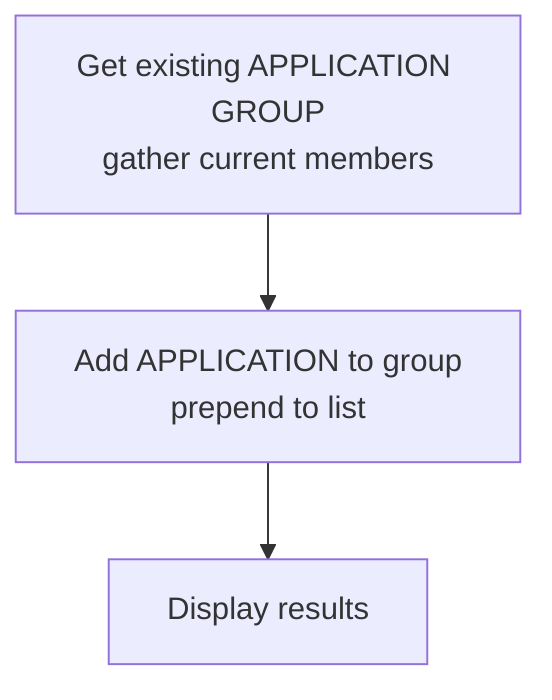

# add_application_to_preset_group.yml

**Location:** `roles/policy_creation/tasks/preset/add_application_to_preset_group.yml`

## Purpose
Adds an application to an existing application group. This is used when traffic matches a preset policy that uses application groups, allowing new applications to be added to existing policies without creating entirely new rules.

## What it does
1. **Retrieves existing group** - Gets the current members of the target application group
2. **Updates application group** - Adds the application to the group (prepending to the list)
3. **Displays results** - Shows the operation status

## Execution Flow



## Required Variables

| Variable | Description |
|----------|-------------|
| `policy_creation_application` | The application to add to the group |
| `application_group` | The name of the application group to update |
| `policy_creation_device_group` | The device group where the application group exists |
| `provider` | PAN-OS connection details (ip_address, username, password) |

## Generated Variables

| Variable | Description |
|----------|-------------|
| `policy_creation_existing_group` | Gathered state of the application group |
| `policy_creation_group_addition` | Result from adding application to group |

## Application Group Update Behavior

### Gathering Existing Members
The task uses `state: gathered` to retrieve the current application group configuration:
```yaml
panos_application_group:
  state: gathered
```

This returns the existing `value` list of member applications.

### Adding New Member
The application is **prepended** to the existing list:
```yaml
value: "{{ [policy_creation_application] + existing_applications }}"
```

This places the new application at the beginning of the group's member list.

### No Duplicate Check
Unlike the address group task, this task does **not** check if the application is already in the group before adding it. This means:
- Running multiple times may add duplicate entries
- The PAN-OS system may handle or reject duplicates

## Dependencies

- Requires PAN-OS collection (`paloaltonetworks.panos`)
- Requires the `panos_application_group` module
- Application group must already exist in the device group
- The application being added must exist (either built-in or custom)

## Usage Context

This file is included from `main.yml` when preset policies match:

```yaml
- name: APP GROUP PRESET - Deploy the application to policy based on preset configuration
  ansible.builtin.include_tasks:
    file: preset/add_application_to_preset_group.yml
  when:
    - application_group is defined
    - policy_creation_application is defined
```

## Preset Policy Integration

For this task to be triggered, a preset policy task file must:

1. Set `policy_creation_policy_match: true`
2. Define the `application_group` variable

Example preset policy task:
```yaml
- name: Check if this matches API traffic policy
  ansible.builtin.set_fact:
    policy_creation_policy_match: true
    application_group: "api-applications"
  when:
    - policy_creation_application is match(".*-api")
```

## Output Display

The debug output shows:
```
App object: ssl
Added to group: web-applications
Device group: Production
Status: SUCCESS
```

Status is determined by whether `policy_creation_group_addition` succeeded.

## Important Differences from Address Group Task

### No Object Creation
- Applications are not created by this task
- The application must already exist in PAN-OS
- Built-in applications (like `ssl`, `http`, `dns`) always exist
- Custom applications must be created separately

### No Duplicate Prevention
- The task does not check if the application is already a member
- May result in duplicate entries if run multiple times
- Consider adding a conditional check similar to the address group task

### Uses 'value' Instead of 'static_value'
- Application groups use the `value` parameter
- Address groups use the `static_value` parameter
- This reflects differences in the underlying PAN-OS module parameters

## Example Scenario

Given:
- Application: `dns`
- Application Group: `datacenter-apps`
- Device Group: `Production`
- Existing group members: `['http', 'https']`

Result:
- Updated group members: `['dns', 'http', 'https']`

## Common Applications

PAN-OS includes thousands of built-in applications. Common examples:
- `ssl` - SSL/TLS traffic
- `web-browsing` - HTTP/HTTPS
- `ssh` - Secure Shell
- `dns` - Domain Name System
- `ping` - ICMP Echo
- `mysql` - MySQL Database
- `ms-rdp` - Remote Desktop

Custom applications can also be defined in Panorama.

## Idempotency Considerations

The task is **partially idempotent**:
- ✅ Won't fail if run multiple times
- ❌ May add duplicate application entries
- ⚠️ Consider adding duplicate detection:

```yaml
when: policy_creation_application not in policy_creation_existing_group.gathered.value
```

## Prerequisites

- The application group must exist before running this task
- The device group must exist and be accessible
- The application must exist (built-in or custom)
- The calling user must have permissions to modify application groups

## Error Scenarios

Common errors:
- **Group doesn't exist**: Task will fail during the gather operation
- **Application doesn't exist**: PAN-OS may accept it but policies won't work correctly
- **Permissions**: User lacks rights to modify application groups

## Related Files

- [add_address_to_preset_group.md](add_address_to_preset_group.md) - Similar workflow for addresses
- [add_url_to_preset_category.md](add_url_to_preset_category.md) - Similar workflow for URLs
- [User Guide: Preset Policies](../user_guide/preset_policy.md) - How to create preset policy files

## Suggested Improvements

Consider enhancing this task to:
1. Add duplicate detection before updating the group
2. Validate that the application exists before adding
3. Handle custom application creation if needed
