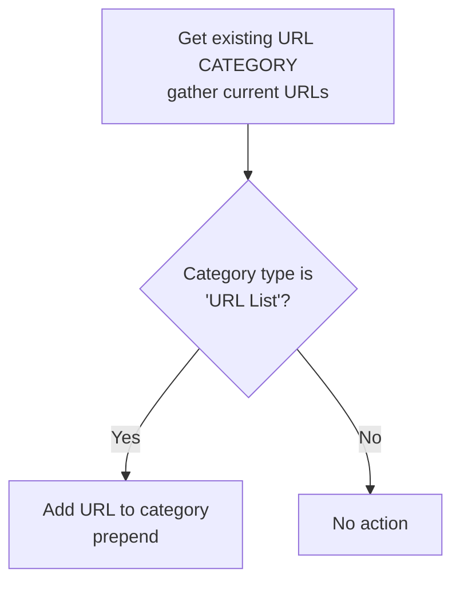

# add_url_to_preset_category.yml

**Location:** `roles/policy_creation/tasks/preset/add_url_to_preset_category.yml`

## Purpose
Adds one or more URLs to an existing custom URL category. This is used when traffic matches a preset policy that uses custom URL categories, allowing new URLs to be added to existing URL filtering policies without creating entirely new rules.

## What it does
1. **Retrieves existing category** - Gets the current URLs in the target custom URL category
2. **Updates URL category** - Adds the URL to the category (prepending to the list)
3. **Registers results** - Captures the operation result

## Execution Flow



## Required Variables

| Variable | Description |
|----------|-------------|
| `url` | The URL to add to the category |
| `destination_url_category` | The name of the custom URL category to update |
| `policy_creation_device_group` | The device group where the URL category exists |
| `provider` | PAN-OS connection details (ip_address, username, password) |

## Generated Variables

| Variable | Description |
|----------|-------------|
| `policy_creation_existing_group` | Gathered state of the URL category |
| `policy_creation_group_addition` | Result from adding URL to category |

## URL Category Update Behavior

### Gathering Existing Category
The task uses `state: gathered` to retrieve the current URL category configuration:
```yaml
panos_custom_url_category:
  state: gathered
```

This returns:
- `type` - The category type (URL List, Category Match, etc.)
- `url_value` - List of URLs (if type is 'URL List')

### Category Type Validation
The task only updates categories of type `'URL List'`:
```yaml
when:
  - policy_creation_existing_group.gathered.type == 'URL List'
```

Other category types are silently skipped.

### Adding New URL
The URL is **prepended** to the existing list:
```yaml
url_value: "{{ [url] + existing_urls }}"
```

This places the new URL at the beginning of the category's URL list.

### No Duplicate Check
The task does **not** check if the URL is already in the category before adding it. This means:
- Running multiple times may add duplicate entries
- The PAN-OS system may handle or reject duplicates

## URL Category Types

PAN-OS supports different types of custom URL categories:

| Type | Description | Supported by Task |
|------|-------------|-------------------|
| URL List | Static list of URLs | ✅ Yes |
| Category Match | Matches built-in categories | ❌ No (skipped) |

Only **URL List** type categories can be updated by this task.

## Dependencies

- Requires PAN-OS collection (`paloaltonetworks.panos`)
- Requires the `panos_custom_url_category` module
- Custom URL category must already exist in the device group
- Category must be type `'URL List'`

## Usage Context

This file is included from `main.yml` when preset policies match:

```yaml
- name: URL CATEGORY PRESET - Deploy the URL to the given category based on preset configuration
  ansible.builtin.include_tasks:
    file: preset/add_url_to_preset_category.yml
  when:
    - destination_url_category is defined
```

## Preset Policy Integration

For this task to be triggered, a preset policy task file must:

1. Set `policy_creation_policy_match: true`
2. Define both variables:
   - `destination_url_category` - The URL category to update
   - `url` - The URL to add

Example preset policy task:
```yaml
- name: Check if this matches blocked sites policy
  ansible.builtin.set_fact:
    policy_creation_policy_match: true
    destination_url_category: "custom-blocked-sites"
    url: "{{ requested_url }}"
  when:
    - block_url is defined
    - block_url | bool
```

## URL Format Examples

URLs can be specified in various formats:

| Format | Example | Description |
|--------|---------|-------------|
| Domain | `example.com` | Matches the exact domain |
| Wildcard subdomain | `*.example.com` | Matches all subdomains |
| Path | `example.com/path` | Matches specific path |
| IP Address | `192.168.1.1` | Matches specific IP |
| CIDR | `192.168.1.0/24` | Matches IP range |

## Example Scenario

Given:
- URL: `malicious.example.com`
- URL Category: `custom-threats`
- Device Group: `Production`
- Category Type: `URL List`
- Existing URLs: `['bad.example.com', 'evil.example.com']`

Result:
- Updated URLs: `['malicious.example.com', 'bad.example.com', 'evil.example.com']`

## Important Notes

### No Debug Output
Unlike the address and application group tasks, this task does **not** include a debug output step. Consider adding one for consistency:

```yaml
- name: Display results
  ansible.builtin.debug:
    msg: |-
      URL: {{ url }}
      Added to category: {{ destination_url_category }}
      Device group: {{ policy_creation_device_group }}
      Status: {{ 'SUCCESS' if policy_creation_group_addition is succeeded else 'FAILED' }}
```

### Silent Failures
If the category type is not `'URL List'`, the task:
- Does not fail
- Does not log a warning
- Simply skips the update

This could lead to confusion if the wrong category type is used.

### Category Must Exist
- The custom URL category must be created before running this task
- The task will fail during gather if the category doesn't exist

## Idempotency Considerations

The task is **partially idempotent**:
- ✅ Won't fail if run multiple times
- ❌ May add duplicate URL entries
- ⚠️ Consider adding duplicate detection:

```yaml
when:
  - policy_creation_existing_group.gathered.type == 'URL List'
  - url not in policy_creation_existing_group.gathered.url_value
```

## Prerequisites

- The custom URL category must exist before running this task
- The category must be type `'URL List'`
- The device group must exist and be accessible
- The calling user must have permissions to modify URL categories

## Error Scenarios

Common errors:
- **Category doesn't exist**: Task will fail during the gather operation
- **Wrong category type**: Task silently skips (no error)
- **Invalid URL format**: PAN-OS may reject during commit
- **Permissions**: User lacks rights to modify URL categories

## Security Policies Using URL Categories

Custom URL categories are typically used in security policies for:
- **URL Filtering** - Block/allow specific sites
- **Application Override** - Force traffic identification
- **Decryption Policies** - Control SSL inspection

Example security policy usage:
```yaml
category: ["custom-threats"]
action: "deny"
```

## Related Files

- [add_address_to_preset_group.md](add_address_to_preset_group.md) - Similar workflow for addresses
- [add_application_to_preset_group.md](add_application_to_preset_group.md) - Similar workflow for applications
- [User Guide: Preset Policy URLs](../user_guide/preset_policy_urls.md) - How to use URL categories in preset policies
- [User Guide: Preset Policies](../user_guide/preset_policy.md) - How to create preset policy files

## Suggested Improvements

Consider enhancing this task to:
1. Add duplicate detection before updating the category
2. Add debug output showing the operation result
3. Log a warning when category type is not 'URL List'
4. Validate URL format before adding
5. Support other category types if applicable
