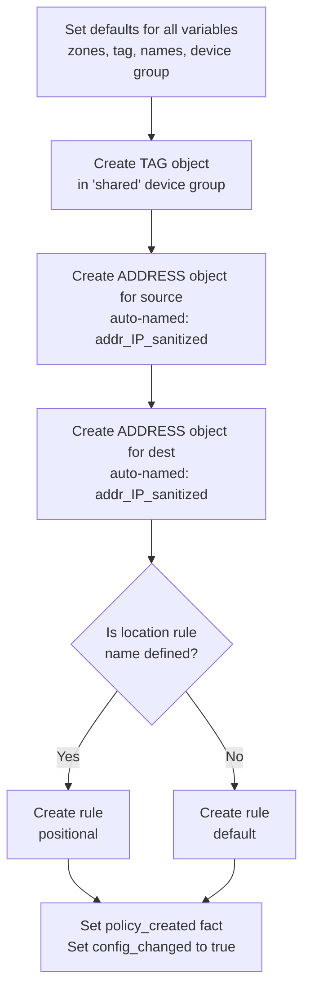

# create_policy.yml

**Location:** `roles/policy_creation/tasks/new/create_policy.yml`

## Purpose
Creates a new security policy with auto-generated address objects and rule placement. This tasks file is executed when no existing preset policies match the traffic requirements and when testing confirms the traffic is not already permitted.

## What it does
1. **Populates defaults** - Sets default values for zones, tags, rule names, address object names, and device groups
2. **Creates tag object** - Creates or ensures the policy tag exists in the shared device group
3. **Creates source address object** - Auto-generates an address object for the source IP
4. **Creates destination address object** - Auto-generates an address object for the destination IP
5. **Creates security rule** - Creates the actual security policy rule with proper positioning

## Execution Flow



## Required Variables

| Variable | Description |
|----------|-------------|
| `policy_creation_source_ip` | Source IP address or CIDR block |
| `policy_creation_destination_ip` | Destination IP address or CIDR block |
| `lookup_policy_application` | Application name for the rule |
| `provider` | PAN-OS connection details (ip_address, username, password) |

## Optional Variables

| Variable | Description | Default |
|----------|-------------|---------|
| `policy_creation_source_zones` | Source zones | `['any']` |
| `policy_creation__security_matches_existing_policy` | Destination zones | `['any']` |
| `policy_creation_tag` | Policy tag | `default_new_policy_tag` |
| `policy_creation_device_group` | Target device group | `default_new_policy_device_group` |
| `default_rule_location` | Rule placement (before/after) | N/A |
| `default_location_rule_name` | Reference rule for positioning | N/A |
| `default_new_policy_tag` | Fallback tag value | N/A |
| `default_new_policy_device_group` | Fallback device group | N/A |

## Generated Variables

| Variable | Format | Description |
|----------|--------|-------------|
| `policy_creation_rule_name` | `autogen_<timestamp>` | Auto-generated rule name using epoch time |
| `policy_creation_source_address_name` | `addr_<ip_sanitized>` | Auto-generated source address object name |
| `policy_creation_destination_address_name` | `addr_<ip_sanitized>` | Auto-generated destination address object name |
| `policy_creation_policy_created` | string | Set to the created rule name |
| `policy_creation_config_changed` | boolean | Set to `true` |

## Address Object Naming

IP addresses are sanitized for object names by:
- Replacing `.` with `_`
- Replacing `/` with `_`

Examples:
- `10.1.1.5` → `addr_10_1_1_5`
- `192.168.1.0/24` → `addr_192_168_1_0_24`
- `2001:db8::1` → `addr_2001:db8::1` (colons not replaced)

## Tag Creation

Tags are created in the **shared** device group with:
- Name: Value from `policy_creation_tag` or `default_new_policy_tag`
- Color: `black`
- Location: `shared` (accessible across all device groups)

## Address Object Creation

Both source and destination address objects are created with:
- **Type**: `ip-netmask`
- **Device Group**: From `policy_creation_device_group`
- **Description**: `"Auto-created address object"`
- **State**: `present` (idempotent - won't fail if already exists)

## Security Rule Creation

Two different tasks create the security rule based on whether positioning is specified:

### Positional Rule Creation
Used when `default_location_rule_name` is defined:

```yaml
location: "{{ default_rule_location }}"  # before/after
existing_rule: "{{ default_location_rule_name }}"
```

This places the new rule relative to an existing rule.

### Default Rule Creation
Used when `default_location_rule_name` is NOT defined:

```yaml
location: "{{ default_rule_location }}"
```

This places the rule at a general location without a reference rule.

### Common Rule Properties

Both variations include:
- **rule_name**: Auto-generated `autogen_<timestamp>`
- **description**: `"Created by automation at <timestamp>"`
- **tag_name**: List containing the policy tag
- **source_zone**: List of source zones
- **source_ip**: List containing the source IP
- **destination_zone**: List of destination zones
- **destination_ip**: List containing the destination IP
- **application**: List containing the application
- **action**: `allow`

## Rule Placement Options

The `default_rule_location` variable can be:
- `before` - Place before the reference rule
- `after` - Place after the reference rule
- `top` - Place at the top of the policy
- `bottom` - Place at the bottom of the policy

When using `before` or `after`, you must also specify `default_location_rule_name`.

## Dependencies

- Requires PAN-OS collection (`paloaltonetworks.panos`)
- Requires the following modules:
  - `panos_tag_object`
  - `panos_address_object`
  - `panos_security_rule`

## Usage Context

This file is included from `main.yml`:

```yaml
- name: Create Rule Block
  block:
    - name: RULE creation
      ansible.builtin.include_tasks:
        file: new/create_policy.yml

    - name: Update that the config has changed
      ansible.builtin.set_fact:
        policy_creation_config_changed: true
  when:
    - not lookup_policy_security_matches_existing_policy
```

Only runs when:
- No existing policy matches the traffic
- Source IP, destination IP, and application are all defined and non-empty

## Important Notes

### Idempotency
- Address objects use `state: present`, so re-running won't fail if objects exist
- Security rules with the same name will be updated rather than duplicated
- Tags with the same name won't cause errors

### Timestamps
- Rule names include epoch timestamp ensuring uniqueness
- Each run creates a new rule name even for identical traffic

### Zone Defaults
- If zones aren't calculated by `get_zone_by_ip.yml`, defaults to `['any']`
- Using `any` for zones may create overly permissive rules

### Device Group Hierarchy
- Tags are created in `shared` for visibility across all device groups
- Address objects are created in the specific device group
- Security rules are created in the specific device group

## Example Generated Objects

For a request with:
- Source: `10.1.1.5/32`
- Destination: `8.8.8.8/32`
- Application: `dns`
- Timestamp: `1638360000`

Generated objects:
- **Tag**: `automated` (or value from `default_new_policy_tag`)
- **Source Address**: `addr_10_1_1_5_32`
- **Dest Address**: `addr_8_8_8_8_32`
- **Rule Name**: `autogen_1638360000`

## Related Files

- [lookup_policy.md](lookup_policy.md) - Determines if this file needs to run
- [get_zone_by_ip.md](get_zone_by_ip.md) - Calculates zones used in the rule
- [security_policy_match.md](security_policy_match.md) - Validates that traffic isn't already permitted
