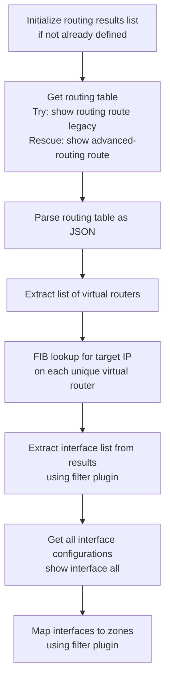

# get_zone_by_ip.yml

**Location:** `roles/policy_creation/tasks/new/get_zone_by_ip.yml`

## Purpose
Determines which security zones are associated with a given IP address by analyzing routing tables and interface configurations. This is essential for automatically calculating the correct zones when creating new security policies.

## What it does
1. **Gets routing table** - Retrieves the routing table from the firewall (legacy or advanced routing)
2. **Extracts virtual routers** - Identifies all virtual routers in the routing table
3. **Performs FIB lookup** - Runs forwarding information base lookup on each virtual router for the target IP
4. **Retrieves interfaces** - Gets the outbound interface(s) from the FIB lookup results
5. **Maps to zones** - Queries interface configuration to determine which zones the interfaces belong to

## Execution Flow



## Required Variables

| Variable | Description |
|----------|-------------|
| `_target_ip` | The IP address to look up (passed as a variable when including this task) |
| `provider` | PAN-OS connection details (ip_address, username, password) |
| `item.serial` | Serial number of the firewall to query (passed via loop) |

## Generated Variables

| Variable | Description |
|----------|-------------|
| `policy_creation__show_route` | List to accumulate routing table results (persists across loop iterations) |
| `policy_creation__show_route_result` | Raw result from the routing table command |
| `policy_creation__show_route_result_dict` | Parsed JSON dictionary of routing table |
| `policy_creation__virtual_routers` | List of all virtual routers found in the routing table |
| `policy_creation__test_routing_result` | Results from FIB lookup tests on each virtual router |
| `policy_creation_interface_list` | List of outbound interfaces for the target IP |
| `policy_creation__show_interfaces_result` | Raw result from show interface all command |
| `policy_creation_destination_zones` | List of zones associated with the target IP (accumulated across devices) |

## Dependencies

- Requires PAN-OS collection (`paloaltonetworks.panos`)
- Requires panos_policy_automation collection for filter plugins:
  - `panos_op_routing_result_to_interfaces` - Extracts interface names from FIB lookup results
  - `panos_op_get_zone_from_interface` - Maps interface names to zone names
- Must be called within a loop passing device serial numbers via `item.serial`

## Routing Table Handling

The task uses a block/rescue structure to handle different PAN-OS versions:

### Legacy Routing (Block)
```bash
show routing route
```
Used by older PAN-OS versions with traditional routing engines.

### Advanced Routing (Rescue)
```bash
show advanced-routing route
```
Used by newer PAN-OS versions with the advanced routing engine (ARE).

This ensures compatibility across different firewall configurations.

## FIB Lookup XML

For each virtual router, the task runs:

```xml
<test>
  <routing>
    <fib-lookup>
      <virtual-router>VR_NAME</virtual-router>
      <ip>TARGET_IP</ip>
    </fib-lookup>
  </routing>
</test>
```

This determines which interface would be used to route traffic to the target IP.

## Zone Resolution Process

1. **Routing Analysis** - Determines outbound interface(s) via FIB lookup
2. **Interface Query** - Gets all interface configurations with `show interface all`
3. **Zone Mapping** - Matches interface names to their assigned zones
4. **Accumulation** - Adds zones to `policy_creation_destination_zones` list

## Important Behavior

### Multiple Virtual Routers
- The task queries ALL unique virtual routers found in the routing table
- If the target IP is reachable via multiple VRs, all corresponding interfaces are found

### Multiple Devices
- When called in a loop across multiple devices, zones are accumulated
- A single IP may resolve to different zones on different firewalls
- The `policy_creation_destination_zones` variable grows with each device iteration

### Zone List Accumulation
The zones are accumulated using this pattern:
```yaml
policy_creation_destination_zones | default([]) + [new_zones] | default([])
```
This ensures zones from multiple devices are combined into a single list.

## Usage Context

This file is included from `lookup_policy.yml`:

```yaml
- name: Get the zone for the DESTINATION IP
  ansible.builtin.include_tasks:
    file: get_zone_by_ip.yml
  vars:
    _target_ip: "{{ policy_creation_destination_ip }}"
  with_items: "{{ policy_creation___device_list }}"
  when:
    - not policy_creation_security_matches_existing_policy
```

Key points:
- Only runs when no existing policy matches
- Runs once per device in the device list
- The `_target_ip` variable is set to the destination IP
- Results accumulate in `policy_creation_destination_zones`

## Example Scenario

Given:
- Target IP: `8.8.8.8`
- Two firewalls in the device group
- Firewall 1: Routes via interface `ethernet1/1` in zone `untrust`
- Firewall 2: Routes via interface `ethernet1/2` in zone `internet`

Result:
- `policy_creation_destination_zones` = `['untrust', 'internet']`

## Performance Notes

- Queries routing tables for ALL virtual routers (could be slow with many VRs)
- Runs FIB lookups sequentially for each virtual router
- Interface queries return all interfaces (can be large on complex firewalls)

## Related Files

- [lookup_policy.md](lookup_policy.md) - Orchestrates zone discovery
- [create_policy.md](create_policy.md) - Uses the discovered zones when creating policies
- [security_policy_match.md](security_policy_match.md) - Determines if zone discovery is needed
