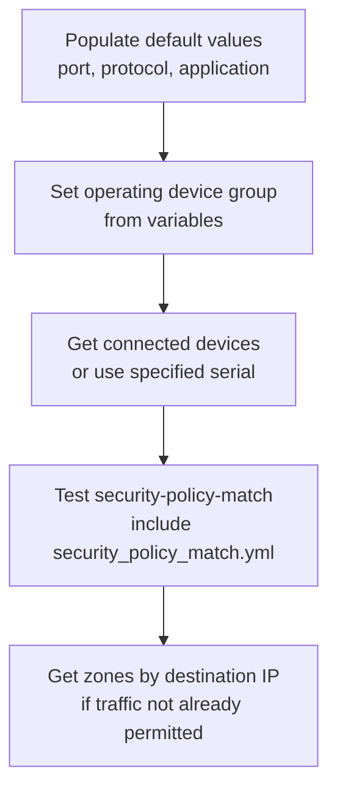

# lookup_policy.yml

**Location:** `roles/policy_creation/tasks/new/lookup_policy.yml`

## Purpose
Tests existing security policies to determine if traffic is already permitted and calculates zones for new policy creation. This is the primary analysis tasks file that determines whether new policies are needed.

## What it does
1. **Populates defaults** - Sets default values for destination port, protocol, and application
2. **Determines device group** - Sets the operating device group from variables
3. **Gets connected devices** - Retrieves list of all firewalls connected to Panorama (or uses specified serial)
4. **Tests security policies** - Runs security-policy-match tests against each device
5. **Calculates destination zones** - Determines appropriate zones based on routing tables (only if policy doesn't exist)

## Execution Flow



## Required Variables

| Variable | Description |
|----------|-------------|
| `policy_creation_source_ip` | Source IP address for policy testing |
| `policy_creation_destination_ip` | Destination IP address for policy testing |
| `provider` | PAN-OS connection details (ip_address, username, password) |

## Optional Variables

| Variable | Description | Default |
|----------|-------------|---------|
| `policy_creation_destination_port` | Destination port for testing | `443` |
| `policy_creation_protocol` | IP protocol number (6=TCP, 17=UDP) | `6` |
| `policy_creation_application` | Application for testing | `ssl` |
| `policy_creation_device_group` | Target device group | N/A |
| `default_new_policy_device_group` | Fallback device group | N/A |
| `default_test_policy_serial_number` | Specific firewall serial for testing | N/A |

## Generated Variables

| Variable | Description |
|----------|-------------|
| `_policy_creation_device_group` | Internal variable for the operating device group |
| `policy_creation__show_devices_output` | Raw output from `show devices connected` command |
| `policy_creation__show_devices_output_dict` | Parsed JSON dictionary of connected devices |
| `policy_creation___device_list` | List of devices to test against |
| `policy_creation_security_matches_existing_policy` | Boolean indicating if traffic is already permitted |
| `policy_creation_destination_zones` | List of calculated destination zones |

## Dependencies

- Requires PAN-OS collection (`paloaltonetworks.panos`)
- Requires panos_policy_automation collection for filter plugins:
  - `panos_op_stdout_to_dict`
- Includes `security_policy_match.yml` for policy testing
- Includes `get_zone_by_ip.yml` for zone calculation
- Must have either `policy_creation_device_group` or `default_new_policy_device_group` defined

## Behavior Notes

### Device Discovery
- If `default_test_policy_serial_number` is NOT defined:
  - Queries Panorama for all connected devices using `show devices connected`
  - Tests security policy match against all connected devices
  - Handles both single device and multiple device responses
- If `default_test_policy_serial_number` IS defined:
  - Uses only the specified firewall for testing
  - Improves performance in large environments

### Zone Calculation
- Only runs if `policy_creation_security_matches_existing_policy` is false
- Determines destination zones by:
  - Getting routing table from each device
  - Running FIB lookup for the destination IP
  - Matching outbound interface to zone configuration
- May resolve a single IP to multiple zones across different devices

## Important Assumptions

1. **No NAT** - Assumes NAT is not in use, or that NAT won't impact the logic
2. **No Intra-zone Traffic** - Assumes traffic is not transiting within the same zone
3. **All Devices** - By default, tests against ALL devices connected to Panorama (can be slow in large environments)

## Performance Considerations

In large environments with many connected firewalls:
- Consider using `default_test_policy_serial_number` to limit testing to a representative firewall
- The device filtering logic can be customized to select a subset based on device group or other runtime parameters

## Example Task Inclusion

This file is typically included from `main.yml`:

```yaml
- name: RULE policy lookup
  ansible.builtin.include_tasks:
    file: new/lookup_policy.yml
```

## Related Files

- [security_policy_match.md](security_policy_match.md) - Performs the actual policy match testing
- [get_zone_by_ip.md](get_zone_by_ip.md) - Calculates zones from routing tables
- [create_policy.md](create_policy.md) - Creates new policies based on this analysis
