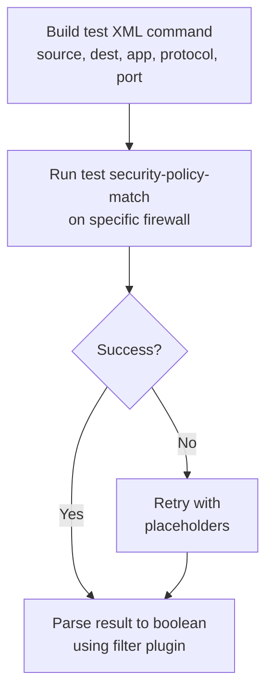

# security_policy_match.yml

**Location:** `roles/policy_creation/tasks/new/security_policy_match.yml`

## Purpose
Runs the `test security-policy-match` command on PAN-OS firewalls to determine if the specified traffic is already permitted by existing security policies. This is a critical validation step before creating new policies.

## What it does
1. **Constructs test XML** - Builds the XML command for security-policy-match with traffic parameters
2. **Executes test** - Runs the test against the specified firewall using its serial number
3. **Handles failures** - Falls back to placeholder test if the initial test fails
4. **Parses result** - Converts the test result to a boolean value indicating policy match

## Execution Flow



## Required Variables

| Variable | Description |
|----------|-------------|
| `policy_creation_source_ip` | Source IP address for the policy match test |
| `policy_creation_destination_ip` | Destination IP address for the policy match test |
| `provider` | PAN-OS connection details (ip_address, username, password) |
| `item.serial` | Serial number of the firewall to test (passed via loop) |

## Optional Variables

| Variable | Description | Default |
|----------|-------------|---------|
| `lookup_policy_application` | Application to test | `ssl` |

## Generated Variables

| Variable | Description |
|----------|-------------|
| `lookup_policy_test_xml` | XML command for the security-policy-match test |
| `lookup_policy_security_policy_match_result` | Raw result from the panos_op command |
| `lookup_policy_security_matches_existing_policy` | Boolean indicating if traffic matches an existing policy |

## Test XML Format

The task constructs an XML command in this format:

```xml
<test>
  <security-policy-match>
    <source>SOURCE_IP</source>
    <destination>DESTINATION_IP</destination>
    <application>APPLICATION</application>
    <protocol>6</protocol>
    <destination-port>443</destination-port>
  </security-policy-match>
</test>
```

### Fixed Values
- **protocol**: Always set to `6` (TCP)
- **destination-port**: Always set to `443` (HTTPS)

Note: The current implementation uses hardcoded values for protocol and port, which may not match the role variables.

## Dependencies

- Requires PAN-OS collection (`paloaltonetworks.panos`)
- Requires panos_policy_automation collection for filter plugin:
  - `panos_op_policy_match_result_to_bool`
- Must be called within a loop passing device serial numbers via `item.serial`

## Error Handling

The task includes a block/rescue structure:

1. **Block** - Attempts to run the test with actual parameters
2. **Rescue** - If the block fails, retries the same test (likely meant to use placeholders but currently identical)

This provides resilience against transient failures but may need refinement for different error scenarios.

## Return Value Interpretation

The filter plugin `panos_op_policy_match_result_to_bool` parses the PAN-OS response to determine:
- **True** - Traffic matches an existing security policy (already permitted)
- **False** - No matching policy found (new policy needed)

## Usage Context

This file is included from `lookup_policy.yml` in a loop:

```yaml
- name: Test the security policy - determines if a new policy is needed
  ansible.builtin.include_tasks:
    file: security_policy_match.yml
  with_items: "{{ lookup_policy__device_list }}"
```

Each iteration tests against a different firewall serial number from the device list.

## Important Notes

### Known Issues
- Line 9 contains a typo: `policy_creation_sourcce_ip` (should be `policy_creation_source_ip`)
  - This may cause the source IP to be undefined in the test
- Protocol and port are hardcoded rather than using role variables
  - Does not respect `lookup_policy_protocol` or `lookup_policy_destination_port`

### Behavior
- Tests are executed against individual firewalls using their serial numbers
- The test queries the actual running security policy on the device
- Results indicate whether traffic would be permitted without any configuration changes

## Example Output

When debugging is enabled, you'll see:
1. The constructed test XML command
2. The raw result from the security-policy-match command
3. The boolean interpretation of the result

## Related Files

- [lookup_policy.md](lookup_policy.md) - Orchestrates the policy testing workflow
- [create_policy.md](create_policy.md) - Creates new policies when this test returns false
- [get_zone_by_ip.md](get_zone_by_ip.md) - Determines zones for new policies
